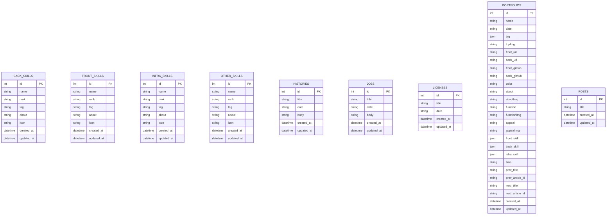

```mermaid
erDiagram
    BACK_SKILLS {
        int id PK
        string name
        string rank
        string tag
        string about
        string icon
        datetime created_at
        datetime updated_at
    }

    FRONT_SKILLS {
        int id PK
        string name
        string rank
        string tag
        string about
        string icon
        datetime created_at
        datetime updated_at
    }

    INFRA_SKILLS {
        int id PK
        string name
        string rank
        string tag
        string about
        string icon
        datetime created_at
        datetime updated_at
    }

    OTHER_SKILLS {
        int id PK
        string name
        string rank
        string tag
        string about
        string icon
        datetime created_at
        datetime updated_at
    }

    HISTORIES {
        int id PK
        string title
        string date
        string body
        datetime created_at
        datetime updated_at
    }

    JOBS {
        int id PK
        string title
        string date
        string body
        datetime created_at
        datetime updated_at
    }

    LICENSES {
        int id PK
        string title
        string date
        datetime created_at
        datetime updated_at
    }

    PORTFOLIOS {
        int id PK
        string name
        string date
        json tag
        string topImg
        string front_url
        string back_url
        string front_github
        string back_github
        string color
        string about
        string aboutImg
        string function
        string functionImg
        string appeal
        string appealImg
        json front_skill
        json back_skill
        json infra_skill
        string time
        string prev_title
        string prev_article_id
        string next_title
        string next_article_id
        datetime created_at
        datetime updated_at
    }

    POSTS {
        int id PK
        string title
        datetime created_at
        datetime updated_at
    }
```
