# ER図

## 概要

このER図は `db/schema.rb` をもとに作成しています。

現時点のスキーマでは外部キー制約やモデルの関連定義は存在しないため、各テーブルは独立したエンティティとして表現しています。`portfolios` の `tag`、`front_skill`、`back_skill`、`infra_skill` は JSON カラムとして保持されています。

## ER図

```mermaid
erDiagram
  back_skills {
    bigint id PK
    string name "NOT NULL"
    string rank "NOT NULL"
    string tag "NOT NULL"
    string about
    string icon "NOT NULL"
    datetime created_at "NOT NULL"
    datetime updated_at "NOT NULL"
  }

  front_skills {
    bigint id PK
    string name "NOT NULL"
    string rank "NOT NULL"
    string tag "NOT NULL"
    string about
    string icon "NOT NULL"
    datetime created_at "NOT NULL"
    datetime updated_at "NOT NULL"
  }

  histories {
    bigint id PK
    string title "NOT NULL"
    string date "NOT NULL"
    string body "NOT NULL"
    datetime created_at "NOT NULL"
    datetime updated_at "NOT NULL"
  }

  infra_skills {
    bigint id PK
    string name "NOT NULL"
    string rank "NOT NULL"
    string tag "NOT NULL"
    string about
    string icon "NOT NULL"
    datetime created_at "NOT NULL"
    datetime updated_at "NOT NULL"
  }

  jobs {
    bigint id PK
    string title "NOT NULL"
    string date "NOT NULL"
    string body "NOT NULL"
    datetime created_at "NOT NULL"
    datetime updated_at "NOT NULL"
  }

  licenses {
    bigint id PK
    string title "NOT NULL"
    string date "NOT NULL"
    datetime created_at "NOT NULL"
    datetime updated_at "NOT NULL"
  }

  other_skills {
    bigint id PK
    string name "NOT NULL"
    string rank "NOT NULL"
    string tag "NOT NULL"
    string about
    string icon "NOT NULL"
    datetime created_at "NOT NULL"
    datetime updated_at "NOT NULL"
  }

  portfolios {
    bigint id PK
    string name "NOT NULL"
    string date "NOT NULL"
    json tag "NOT NULL"
    string topImg "NOT NULL"
    string front_url
    string back_url
    string front_github
    string back_github
    string color
    string about
    string aboutImg
    string function_desc "column: function"
    string functionImg
    string appeal
    string appealImg
    json front_skill
    json back_skill
    json infra_skill
    string time "NOT NULL"
    string prev_title
    string prev_article_id
    string next_title
    string next_article_id
    datetime created_at "NOT NULL"
    datetime updated_at "NOT NULL"
  }

  posts {
    bigint id PK
    string title
    datetime created_at "NOT NULL"
    datetime updated_at "NOT NULL"
  }

  profile {
    integer id PK
    text content
    text hobby
    text license
  }

  profiles {
    bigint id PK
    string content "NOT NULL"
    string hobby "NOT NULL"
    string license "NOT NULL"
    datetime created_at "NOT NULL"
    datetime updated_at "NOT NULL"
  }

  users {
    bigint id PK
    string email "NOT NULL UNIQUE"
    string password_digest "NOT NULL"
    datetime created_at "NOT NULL"
    datetime updated_at "NOT NULL"
  }
```

## 補足

| 項目 | 内容 |
| --- | --- |
| 関連 | 現時点では外部キー制約、モデル関連ともに未定義 |
| `users.email` | 一意インデックスあり |
| `portfolios.tag` | JSON 形式でタグ一覧を保持 |
| `portfolios.front_skill` | JSON 形式でフロントエンドスキル一覧を保持 |
| `portfolios.back_skill` | JSON 形式でバックエンドスキル一覧を保持 |
| `portfolios.infra_skill` | JSON 形式でインフラスキル一覧を保持 |
| `profile` と `profiles` | スキーマ上は別テーブルとして存在 |
